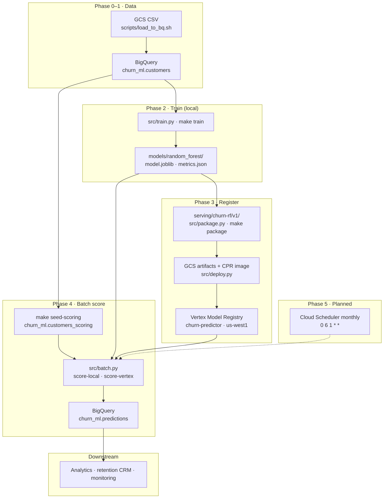
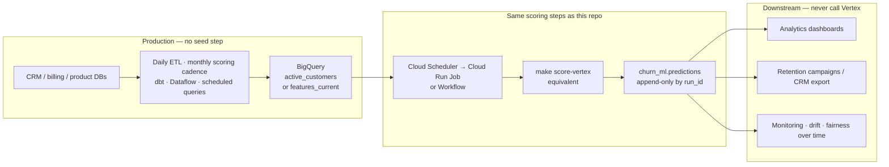
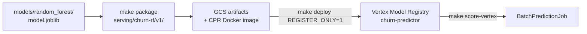

# vertex-churn-pipeline

Churn prediction portfolio project on **Google Cloud**: BigQuery → local training → **Vertex Model Registry** → batch predictions back to BigQuery.

Designed to demonstrate end-to-end ML on GCP: train locally, register the champion in Vertex, batch-score into BigQuery for analytics.

## System overview

High-level flow (top to bottom). Detailed step diagrams are in [Pipelines at a glance](#pipelines-at-a-glance) below.



**Key idea:** Vertex stores the **model**; BigQuery stores the **scores**. Downstream teams query `predictions`, not Vertex.

## Pipelines at a glance

Two flows share the same **preprocessing logic** (`src/preprocess.py`) but differ after the model is fit: training writes artifacts to disk; scoring reads a BQ population and writes predictions back to BQ.

### Training pipeline

Historical data with labels → fit models → save artifacts + metrics.

```mermaid
flowchart LR
  subgraph ingest["Phase 1 — Data"]
    CSV["GCS CSV\ntelco-customer-churn.csv"]
    BQc["BigQuery\nchurn_ml.customers\n(+ Churn label)"]
    CSV -->|"load_to_bq.sh"| BQc
  end

  subgraph train["Phase 2 — make train"]
    Load["data.load_customers()"]
    Clean["preprocess.clean()\nTotalCharges, dtypes"]
    Split["make_dataset()\n18 baseline features\n+ customerID join key"]
    Hold["Stratified split\n70% train / 15% val / 15% test"]
    Prep["build_preprocessor()\nOHE + optional scale"]
    Fit["sklearn Pipeline\nLogReg · RF · XGB · LGBM"]
    Tune["CV on train\nthreshold on val"]
    Test["Test metrics\n+ fairness_by_gender"]
    Art["models/{model}/\nmodel.joblib\nmetrics.json"]
    BQc --> Load --> Clean --> Split --> Hold --> Prep --> Fit --> Tune --> Test --> Art
  end
```



**Commands:** `./scripts/load_to_bq.sh` → `make train` → `make fairness`

**Outputs:** `models/random_forest/model.joblib` (champion), `metrics.json` (threshold ~0.441, test F1/PR-AUC, fairness slices). Threshold is stored **outside** the sklearn pipeline and applied at scoring time.

Details: [docs/phase-2-modeling.md](docs/phase-2-modeling.md) · [docs/train-code-map.md](docs/train-code-map.md) (navigate `train.py` by section)

### Batch scoring pipeline

Score an **active customer population** (features only, no churn label) and append predictions to BigQuery for analytics and retention workflows.

```mermaid
flowchart LR
  subgraph demo["This repo — demo seed step"]
    BQfull["churn_ml.customers\n(static telco snapshot)"]
    BQscore["churn_ml.customers_scoring\nrandom sample · no Churn\n+ as_of_date"]
    BQfull -->|"make seed-scoring"| BQscore
  end

  subgraph prep["Shared preprocessing"]
    Read["load_scoring_frame()"]
    Clean2["preprocess.clean()\n18 raw feature cols"]
    Read --> Clean2
    BQscore --> Read
  end

  subgraph paths["Scoring path"]
    Local["make score-local\nlocal model.joblib"]
    Vertex["make score-vertex\nVertex BatchPredictionJob"]
    Clean2 --> Local
    Clean2 --> Vertex
  end

  subgraph infer["Inference"]
    Proba["predict_proba → threshold\nchurn_probability + churn_flag"]
    Local --> Proba
    GCSin["GCS input JSONL\n+customerID passthrough"]
    CPR["CPR container\n/predict"]
    GCSout["GCS output JSONL"]
    Vertex --> GCSin --> CPR --> GCSout --> Proba
  end

  subgraph out["Predictions table"]
    Pred["churn_ml.predictions\npartitioned by scored_at\nrun_id · model_version"]
    Proba -->|"write_predictions()"| Pred
  end
```



#### What is `make seed-scoring`?

**Seed scoring does not run the model.** It only creates (or replaces) the input table `churn_ml.customers_scoring` — the population you intend to score.

| | What it does | What it does *not* do |
|---|---|---|
| **`make seed-scoring`** | Copies a random sample from `customers`, drops the `Churn` label, adds `as_of_date` | Score anyone, change feature values, or write to `predictions` |
| **`make score-local` / `make score-vertex`** | Reads `customers_scoring`, preprocesses, runs the model, appends rows to `predictions` | Create the scoring population |

We drop `Churn` on purpose: in production you score **before** you know who cancelled. The training table (`customers`) keeps labels; the scoring table does not.

The sample is **not synthetic data** — it is real rows from the telco snapshot, unchanged except for removing the label. It stands in for “this period’s accounts to score” because this portfolio uses a static CSV, not a live CRM feed.

#### How it would work in production (no fake seed)

You would **skip `make seed-scoring` entirely**. An upstream pipeline would already maintain the scoring population in BigQuery:



| Demo (this repo) | Production |
|---|---|
| `customers` = static telco CSV in BQ | Warehouse tables refreshed by ETL (tenure, charges, contract, etc.) |
| `make seed-scoring` = random sample, no label | `active_customers` (or similar) = all accounts due for scoring; no label column |
| Manual `make score-*` | Cloud Scheduler triggers batch job **monthly** (e.g. 1st of month, 6am) |
| Same `predictions` table shape | Same pattern: `customerID`, proba, flag, `scored_at`, `run_id`, `model_version` |

**Why monthly, not weekly?** The shortest contract in this dataset is month-to-month — tenure, charges, and contract status typically move on a **billing cycle**, not a weekly one. Scoring every week would mostly re-read unchanged rows. A monthly batch aligns with when features actually update and matches how retention teams often run outreach campaigns.

Vertex **Model Registry** holds *which model version* scored the batch. **BigQuery `predictions`** is what marketing, analytics, and ops actually query.

#### Commands (demo)

```bash
make seed-scoring          # 1. build customers_scoring (skip in production)
make score-local           # 2a. score with local artifact → BQ (free)
make score-vertex          # 2b. score via registered model → BQ (batch job cost)
```

Verify predictions:

```sql
SELECT customerID, churn_probability, churn_flag, run_id, scored_at
FROM `churn-predictor-ml-2026.churn_ml.predictions`
ORDER BY scored_at DESC
LIMIT 20;
```

Details: [docs/phase-4-batch.md](docs/phase-4-batch.md)

#### Batch + cache hybrid (how I would serve in-app reads)

Monthly batch writes scores to BigQuery. A **post-batch warm job** exports the latest row per customer to a read cache (Redis/Memorystore in production; local JSONL in this repo). Product APIs read the cache — no Vertex call on the hot path.

```bash
make score-local                              # 1. batch → predictions (BQ)
make warm-cache                               # 2. post-batch → data/cache/churn_scores.jsonl
make cache-lookup CUSTOMER_ID=7590-VHVEG      # 3. app-style read (milliseconds, no model)
```

Contrast `make predict CUSTOMER_ID=…`, which re-runs the model for debugging only.

Full comparison (batch vs endpoint vs hybrid): [docs/inference-patterns.md](docs/inference-patterns.md) · SQL view: [sql/03_predictions_latest.sql](sql/03_predictions_latest.sql)

### Model registration (between train and Vertex scoring)



Details: [docs/phase-3-deploy.md](docs/phase-3-deploy.md)

## Architecture (summary)

```text
GCS CSV → BigQuery customers
       → train → models/ (local artifacts)
       → package + register → Vertex Model Registry
       → batch score → BigQuery predictions  ← analytics / production consumers
```

Optional: `make deploy` (without `REGISTER_ONLY`) attaches the model to an **online endpoint** for real-time demos; monthly batch scoring does not require a running endpoint. For in-app reads at scale, see [inference patterns](docs/inference-patterns.md) (batch + cache hybrid).

## Cost note

Vertex AI is **not** always-free. This project is built to stay cheap:

- Train locally first (no Vertex compute)
- BigQuery free tier covers a small dataset
- Deploy endpoints only for demos, then **undeploy**

New GCP accounts get **$300 credit for 90 days**. See [docs/phase-0-setup.md](docs/phase-0-setup.md) for details.

## Setup

### Prerequisites

- Google Cloud account with billing (trial OK)
- `gcloud` CLI, `bq`
- [`uv`](https://docs.astral.sh/uv/) (manages Python 3.10-3.12 + dependencies)

### Quick start

```bash
# 1. Clone and enter repo
cd vertex-churn-pipeline

# 2. Python env (uv — reproducible from uv.lock)
uv sync
source .venv/bin/activate

# macOS only: xgboost needs the OpenMP runtime
brew install libomp

# 3. Configure
cp .env.example .env
# Edit .env with your GCP_PROJECT_ID, GCS_BUCKET, etc.

# 4. Authenticate (one-time)
gcloud auth login
gcloud auth application-default login

# 5. Provision GCP resources
export GCP_PROJECT_ID=churn-predictor-ml-2026
export GCP_REGION=us-west1
export GCS_BUCKET=churn-predictor-ml-artifacts
./scripts/setup_gcp.sh
```

Full walkthrough: **[docs/phase-0-setup.md](docs/phase-0-setup.md)**

## Project phases

End-to-end flow: **load data → train → register model → batch score to BQ**. Optional online endpoint for demos only.

| Phase | Status | What you get | Key commands / docs |
|-------|--------|--------------|---------------------|
| **0** | Done | GCP project, APIs, GCS bucket, BQ dataset, local Python env | [phase-0-setup.md](docs/phase-0-setup.md) · `./scripts/setup_gcp.sh` |
| **1** | Done | Telco CSV in BigQuery (`churn_ml.customers`) | [phase-1-data.md](docs/phase-1-data.md) · `./scripts/load_to_bq.sh` |
| **2** | Done | Trained models, threshold tuning, fairness slices, local artifacts | [phase-2-modeling.md](docs/phase-2-modeling.md) · `make train` · `make fairness` |
| **3** | Done | RF champion packaged; CPR image + **Model Registry** (`churn-predictor`, us-west1) | [phase-3-deploy.md](docs/phase-3-deploy.md) · `make package` · `make deploy REGISTER_ONLY=1` |
| **4** | Done | Batch scoring → **`churn_ml.predictions`** (local + Vertex batch paths) | [phase-4-batch.md](docs/phase-4-batch.md) · [inference-patterns.md](docs/inference-patterns.md) · `make score-*` · `make warm-cache` |
| **5** | Planned | **Monthly** Cloud Scheduler + monitoring / second model version | Automate `score-vertex` (cron `0 6 1 * *`); prediction drift dashboards |

### Phase 4 note (demo vs production)

| Step | This repo (demo) | Production |
|------|------------------|------------|
| Scoring population | `make seed-scoring` → `customers_scoring` | ETL-maintained table (e.g. `active_customers`) — **no seed step** |
| Inference | `make score-local` or `make score-vertex` | Same batch job, triggered monthly |
| Consumers | Query `predictions` in BQ | Analytics, retention CRM, monitoring |

Phase 4 code is complete; Phase 5 is wiring the **monthly schedule** and optional observability (see [Batch scoring pipeline](#batch-scoring-pipeline) above).

### Suggested run order (first time)

```bash
./scripts/setup_gcp.sh && ./scripts/load_to_bq.sh   # phases 0–1
make train && make fairness                          # phase 2
make package-test && make deploy REGISTER_ONLY=1     # phase 3
make seed-scoring && make score-local                # phase 4 (demo)
make score-vertex                                    # phase 4 (Vertex batch — after re-register if needed)
```

**Extended guide:** [docs/project-walkthrough.md](docs/project-walkthrough.md)

## Project walkthrough

Use this section to navigate the repo by topic. Each step links to the folders and files worth opening.

### Problem and outcome

- **Problem:** telco churn (~27% positive); retention needs ranked risk, not raw model output.
- **Outcome:** train locally → register **Random Forest** in Vertex → batch scores land in **`churn_ml.predictions`**.
- **Docs:** [notebooks/01_eda.ipynb](notebooks/01_eda.ipynb) (EDA that drove preprocessing)

### 1. Data ingestion (Phase 0–1)

| Open | Why |
|------|-----|
| [scripts/setup_gcp.sh](scripts/setup_gcp.sh) | APIs, bucket, BQ dataset, IAM for Vertex |
| [scripts/load_to_bq.sh](scripts/load_to_bq.sh) | CSV → `churn_ml.customers` |
| [src/config.py](src/config.py) · [src/data.py](src/data.py) | Project/table IDs, BQ load |
| [sql/01_explore.sql](sql/01_explore.sql) | Exploration queries |
| [docs/phase-0-setup.md](docs/phase-0-setup.md) · [docs/phase-1-data.md](docs/phase-1-data.md) | Setup walkthroughs |

### 2. Training and evaluation (Phase 2)

**[`train.py` code map](docs/train-code-map.md)** — section guide; start at `main()` → `train_one()`, not line 1.

| Open | Why |
|------|-----|
| [docs/train-code-map.md](docs/train-code-map.md) | Navigate ~1,500 lines by section |
| [src/preprocess.py](src/preprocess.py) | Cleaning, features, `PROTECTED_COLS`, join key |
| [src/train.py](src/train.py) | `main()` (~1201), `train_one()` (~785), `fairness_audit()` (~363) |
| [models/random_forest/metrics.json](models/random_forest/metrics.json) | Test vs validation vs CV; threshold ~0.441 |
| [models/random_forest/](models/random_forest/) | Champion artifact + SHAP plots |
| [experiments/baseline/](experiments/baseline/) | Baseline vs engineered comparison |
| [src/inspect.py](src/inspect.py) | `make fairness` — slices from saved metrics |
| [docs/phase-2-modeling.md](docs/phase-2-modeling.md) | Metrics reporting, defaults, experiments |

**Champion choice:** XGBoost wins CV slightly; **Random Forest** wins **test** F1 (~0.62) and PR-AUC — see [serving/churn-rf/CHANGELOG.md](serving/churn-rf/CHANGELOG.md).

### 3. Packaging and registration (Phase 3)

| Open | Why |
|------|-----|
| [src/champion.py](src/champion.py) | Paths, manifest, scoring helpers |
| [src/package.py](src/package.py) | Assemble `serving/churn-rf/v1/` |
| [serving/churn-rf/v1/predictor.py](serving/churn-rf/v1/predictor.py) | CPR: load → preprocess → predict → threshold |
| [serving/churn-rf/v1/](serving/churn-rf/v1/) | Bundle after `make package` |
| [src/deploy.py](src/deploy.py) | GCS upload, CPR image, Registry |
| [docs/phase-3-deploy.md](docs/phase-3-deploy.md) | Docker, IAM, `/predict` + `/health` routes |

**Design point:** threshold lives in [threshold.json](serving/churn-rf/v1/threshold.json), not inside `model.joblib`.

### 4. Batch scoring to BigQuery (Phase 4)

| Open | Why |
|------|-----|
| [src/batch.py](src/batch.py) | `seed`, `score-local`, `score-vertex`, write to BQ |
| [src/cache_warm.py](src/cache_warm.py) | Post-batch cache export + lookup (hybrid demo) |
| [sql/02_predictions.sql](sql/02_predictions.sql) | Sample queries on `predictions` |
| [sql/03_predictions_latest.sql](sql/03_predictions_latest.sql) | Latest score per customer (cache source) |
| [docs/inference-patterns.md](docs/inference-patterns.md) | Batch vs endpoint vs batch+cache |
| [docs/phase-4-batch.md](docs/phase-4-batch.md) | Demo vs production, monthly cadence |

| Command | Role |
|---------|------|
| `make seed-scoring` | Demo only — builds `customers_scoring` (no label) |
| `make score-local` | Fast path — local `model.joblib` → BQ |
| `make score-vertex` | Production-like — Vertex BatchPredictionJob → BQ |
| `make warm-cache` | Post-batch — export latest scores to read cache |
| `make cache-lookup CUSTOMER_ID=…` | App-style read from cache (no model call) |

### 5. Tests and quality

| Open | Why |
|------|-----|
| [tests/](tests/) | 43 tests — preprocess, train, package, batch, serving parity |
| [Makefile](Makefile) | All commands in one place |

### 6. Planned (Phase 5)

- Monthly **Cloud Scheduler** → `score-vertex` (cron `0 6 1 * *`)
- Prediction monitoring / drift by `run_id`
- Second model version + gated promotion

### Quick demo commands

```bash
make fairness MODEL=random_forest
make predict CUSTOMER_ID=7590-VHVEG
make score-local    # after make seed-scoring
```

## Repo structure

```text
vertex-churn-pipeline/
├── configs/           # non-secret config
├── docs/              # setup, phase guides, project-walkthrough.md
├── experiments/       # baseline vs engineered comparisons
├── models/            # metrics + plots in git; model.joblib local only
├── notebooks/         # EDA (01_eda.ipynb)
├── scripts/           # setup_gcp.sh, load_to_bq.sh
├── serving/           # CPR bundle (churn-rf/v1/, CHANGELOG.md)
├── sql/               # BigQuery exploration queries
├── src/               # pipeline library + CLI entrypoints (see below)
├── tests/
├── pyproject.toml     # dependencies (source of truth)
├── uv.lock            # pinned, reproducible env (committed)
├── requirements.txt   # kept in sync for non-uv users
└── .env.example
```

### Source layout (`src/`)

The pipeline code lives in a flat `src/` package (~9 modules). That matches the scope of this project: one dataset, one champion model line, and a small set of Makefile-driven commands.

| Module | Role |
|--------|------|
| `config.py`, `data.py`, `preprocess.py` | BigQuery load, feature prep, train/test split |
| `train.py` | Train all model types, tune threshold, write `metrics.json` (incl. fairness slices) |
| `champion.py` | Champion paths, artifact loading, serving manifest metadata |
| `predict.py` | Score a customer row locally (parity check before deploy) |
| `inspect.py` | Print saved fairness slices from `metrics.json` (`make fairness`) |
| `package.py` | Build `serving/churn-rf/v1/` CPR bundle |
| `deploy.py` | Upload bundle to GCS, register in Vertex, deploy endpoint |
| `batch.py` | Seed `customers_scoring`, score to `predictions` (local or Vertex batch) |
| `cache_warm.py` | Export `predictions_latest` to read cache (hybrid pattern showcase) |

Boundaries that matter more than folder depth:

- **Train** writes to `models/`; **serve** reads from `serving/churn-rf/vN/` (threshold applied outside the sklearn pipeline).
- **Notebooks** are for exploration; reusable logic stays in `src/`.
- **Serving** has its own `requirements.txt` — Vertex builds a minimal prediction image, not the full training env.

### How this would scale

For a larger system (batch scoring, monitoring, multiple model lines, shared feature store), I would split on **domain boundaries**, not file count:

```text
src/churn/
├── data.py, preprocess.py     # ingestion + features
├── train.py, champion.py      # training + artifact contract
└── cli/
    predict.py, inspect.py
    package.py, deploy.py      # thin entrypoints; library code stays importable
```

Further growth might add `training/`, `serving/`, and `monitoring/` packages once modules stop fitting in one directory or teams own separate areas. This repo stays flat until that pain shows up — avoiding structure for its own sake keeps the walkthrough simple while still showing where the seams are.

## License

Portfolio / educational use.
