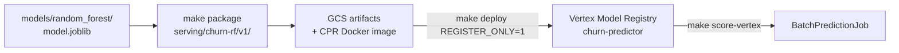

# vertex-churn-pipeline

Churn prediction portfolio project on **Google Cloud**: BigQuery → training → **Vertex AI Model Registry** → endpoint deployment.

Designed to demonstrate end-to-end ML on GCP: train locally, register the champion in Vertex, batch-score into BigQuery for analytics.

## Pipelines at a glance

Two flows share the same **preprocessing logic** (`src/preprocess.py`) but differ after the model is fit: training writes artifacts to disk; scoring reads a BQ population and writes predictions back to BQ.

### Training pipeline

Historical data with labels → fit models → save artifacts + metrics.

```mermaid
flowchart LR
  subgraph ingest["Phase 1 — Data"]
    CSV["GCS CSV\ntelco-customer-churn.csv"]
    BQc["BigQuery\nchurn_ml.customers\n(+ Churn label)"]
    CSV -->|"load_to_bq.sh"| BQc
  end

  subgraph train["Phase 2 — make train"]
    Load["data.load_customers()"]
    Clean["preprocess.clean()\nTotalCharges, dtypes"]
    Split["make_dataset()\n18 baseline features\n+ customerID join key"]
    Hold["Stratified split\n70% train / 15% val / 15% test"]
    Prep["build_preprocessor()\nOHE + optional scale"]
    Fit["sklearn Pipeline\nLogReg · RF · XGB · LGBM"]
    Tune["CV on train\nthreshold on val"]
    Test["Test metrics\n+ fairness_by_gender"]
    Art["models/{model}/\nmodel.joblib\nmetrics.json"]
    BQc --> Load --> Clean --> Split --> Hold --> Prep --> Fit --> Tune --> Test --> Art
  end
```



**Commands:** `./scripts/load_to_bq.sh` → `make train` → `make fairness`

**Outputs:** `models/random_forest/model.joblib` (champion), `metrics.json` (threshold ~0.441, test F1/PR-AUC, fairness slices). Threshold is stored **outside** the sklearn pipeline and applied at scoring time.

Details: [docs/phase-2-modeling.md](docs/phase-2-modeling.md)

### Batch scoring pipeline

Live-like population **without labels** → score → append predictions to BigQuery.

```mermaid
flowchart LR
  subgraph seed["Seed scoring population"]
    BQfull["churn_ml.customers\n(full snapshot)"]
    BQscore["churn_ml.customers_scoring\nno Churn label\n+ as_of_date"]
    BQfull -->|"make seed-scoring\nrandom sample"| BQscore
  end

  subgraph prep["Shared preprocessing"]
    Read["load_scoring_frame()"]
    Clean2["preprocess.clean()\n18 raw feature cols"]
    Read --> Clean2
    BQscore --> Read
  end

  subgraph paths["Scoring path"]
    Local["make score-local\nlocal model.joblib"]
    Vertex["make score-vertex\nVertex BatchPredictionJob"]
    Clean2 --> Local
    Clean2 --> Vertex
  end

  subgraph infer["Inference"]
    Proba["predict_proba → threshold\nchurn_probability + churn_flag"]
    Local --> Proba
    GCSin["GCS input JSONL\n+customerID passthrough"]
    CPR["CPR container\n/predict"]
    GCSout["GCS output JSONL"]
    Vertex --> GCSin --> CPR --> GCSout --> Proba
  end

  subgraph out["Phase 4 — Predictions table"]
    Pred["churn_ml.predictions\npartitioned by scored_at\nrun_id · model_version"]
    Proba -->|"write_predictions()"| Pred
  end
```



**Commands:**

```bash
make seed-scoring          # create customers_scoring (simulated live feed)
make score-local           # score with local artifact → BQ (free)
make score-vertex          # score via registered model → BQ (batch job cost)
```

**Who reads what:** analysts and retention workflows query **`predictions`** in BigQuery — not Vertex. Registry only holds the model version used to score.

Details: [docs/phase-4-batch.md](docs/phase-4-batch.md)

### Model registration (between train and Vertex scoring)



Details: [docs/phase-3-deploy.md](docs/phase-3-deploy.md)

## Architecture (summary)

```text
GCS CSV → BigQuery customers
       → train → models/ (local artifacts)
       → package + register → Vertex Model Registry
       → batch score → BigQuery predictions  ← analytics / production consumers
```

Optional: `make deploy` (without `REGISTER_ONLY`) attaches the model to an **online endpoint** for real-time demos; weekly batch scoring does not require a running endpoint.

## Cost note

Vertex AI is **not** always-free. This project is built to stay cheap:

- Train locally first (no Vertex compute)
- BigQuery free tier covers a small dataset
- Deploy endpoints only for demos, then **undeploy**

New GCP accounts get **$300 credit for 90 days**. See [docs/phase-0-setup.md](docs/phase-0-setup.md) for details.

## Phase 0 — Setup (current)

### Prerequisites

- Google Cloud account with billing (trial OK)
- `gcloud` CLI, `bq`
- [`uv`](https://docs.astral.sh/uv/) (manages Python 3.10-3.12 + dependencies)

### Quick start

```bash
# 1. Clone and enter repo
cd vertex-churn-pipeline

# 2. Python env (uv — reproducible from uv.lock)
uv sync
source .venv/bin/activate

# macOS only: xgboost needs the OpenMP runtime
brew install libomp

# 3. Configure
cp .env.example .env
# Edit .env with your GCP_PROJECT_ID, GCS_BUCKET, etc.

# 4. Authenticate (one-time)
gcloud auth login
gcloud auth application-default login

# 5. Provision GCP resources
export GCP_PROJECT_ID=churn-predictor-ml-2026
export GCP_REGION=us-west1
export GCS_BUCKET=churn-predictor-ml-artifacts
./scripts/setup_gcp.sh
```

Full walkthrough: **[docs/phase-0-setup.md](docs/phase-0-setup.md)**

## Project phases

| Phase | Status | Description |
|-------|--------|-------------|
| 0 | **Done** | GCP project, APIs, bucket, BQ dataset, local env |
| 1 | **In progress** | Load Telco churn data into BigQuery |
| 2 | **Done** | EDA, train & evaluate locally |
| 3 | **Done** | Register RF champion in Vertex Model Registry — see [docs/phase-3-deploy.md](docs/phase-3-deploy.md) |
| 4 | **In progress** | Batch score to BigQuery (`customers_scoring` → `predictions`) — see [docs/phase-4-batch.md](docs/phase-4-batch.md) |

See [docs/phase-1-data.md](docs/phase-1-data.md) for the data loading walkthrough.

## Repo structure

```text
vertex-churn-pipeline/
├── configs/           # non-secret config
├── docs/              # setup & phase guides
├── experiments/       # baseline vs engineered comparisons
├── models/            # trained artifacts (local, gitignored)
├── notebooks/         # EDA (01_eda.ipynb)
├── scripts/           # setup_gcp.sh, load_to_bq.sh
├── serving/           # CPR bundle (churn-rf/v1/, CHANGELOG.md)
├── sql/               # BigQuery exploration queries
├── src/               # pipeline library + CLI entrypoints (see below)
├── tests/
├── pyproject.toml     # dependencies (source of truth)
├── uv.lock            # pinned, reproducible env (committed)
├── requirements.txt   # kept in sync for non-uv users
└── .env.example
```

### Source layout (`src/`)

The pipeline code lives in a flat `src/` package (~9 modules). That matches the scope of this project: one dataset, one champion model line, and a small set of Makefile-driven commands.

| Module | Role |
|--------|------|
| `config.py`, `data.py`, `preprocess.py` | BigQuery load, feature prep, train/test split |
| `train.py` | Train all model types, tune threshold, write `metrics.json` (incl. fairness slices) |
| `champion.py` | Champion paths, artifact loading, serving manifest metadata |
| `predict.py` | Score a customer row locally (parity check before deploy) |
| `inspect.py` | Print saved fairness slices from `metrics.json` (`make fairness`) |
| `package.py` | Build `serving/churn-rf/v1/` CPR bundle |
| `deploy.py` | Upload bundle to GCS, register in Vertex, deploy endpoint |
| `batch.py` | Seed `customers_scoring`, score to `predictions` (local or Vertex batch) |

Boundaries that matter more than folder depth:

- **Train** writes to `models/`; **serve** reads from `serving/churn-rf/vN/` (threshold applied outside the sklearn pipeline).
- **Notebooks** are for exploration; reusable logic stays in `src/`.
- **Serving** has its own `requirements.txt` — Vertex builds a minimal prediction image, not the full training env.

### How this would scale

For a larger system (batch scoring, monitoring, multiple model lines, shared feature store), I would split on **domain boundaries**, not file count:

```text
src/churn/
├── data.py, preprocess.py     # ingestion + features
├── train.py, champion.py      # training + artifact contract
└── cli/
    predict.py, inspect.py
    package.py, deploy.py      # thin entrypoints; library code stays importable
```

Further growth might add `training/`, `serving/`, and `monitoring/` packages once modules stop fitting in one directory or teams own separate areas. This repo stays flat until that pain shows up — avoiding structure for its own sake keeps the demo easy to walk through in an interview while still showing where the seams are.

## License

Portfolio / educational use.
