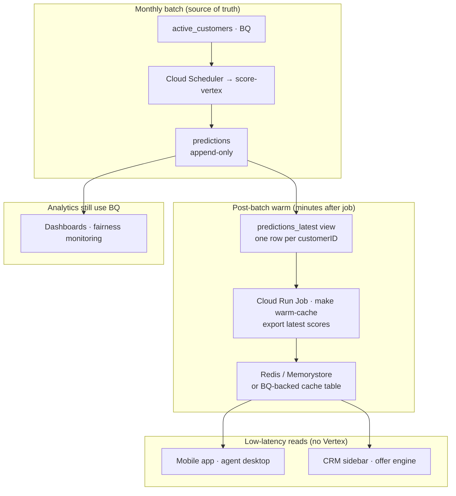

# Inference patterns

Three ways to serve churn scores from this project. **What is built in the repo** is batch → BigQuery. The **batch + cache hybrid** is the pattern I would use for in-app or CRM lookups at scale without a 24/7 Vertex endpoint.

## Comparison

| Pattern | When it fits | Cost profile | In this repo |
|---------|--------------|--------------|--------------|
| **Batch → BigQuery** | Campaigns, dashboards, monthly retention lists | Pay per batch job + BQ storage | `make score-vertex` → `predictions` |
| **Online endpoint** | True real-time re-score on every request (rare here) | Endpoint nodes run 24/7 | `make deploy` (demo only; `make undeploy` after) |
| **Batch + cache hybrid** | Many reads, scores refresh on a schedule (monthly here) | Batch job monthly + small cache | [sql/03_predictions_latest.sql](../sql/03_predictions_latest.sql) + `make warm-cache` |

Scores for telco churn in this dataset change on **billing cycles**, not per page view. Re-running the model on every app open would add latency and cost without improving freshness. A monthly batch job plus a read cache matches that reality.

---

## 1. Batch → BigQuery (implemented)

```text
customers_scoring (BQ)
  → Vertex BatchPredictionJob (or score-local in dev)
  → churn_ml.predictions (append-only, partitioned by scored_at)
  → campaigns · Looker · SQL exports
```

Downstream consumers query BigQuery directly. No model call at read time.

Details: [phase-4-batch.md](phase-4-batch.md)

---

## 2. Online endpoint (demo only)

```text
App → Vertex Online Prediction endpoint → CPR container → response
```

Useful to prove the serving bundle and latency in a live demo. For this portfolio, register the model (`REGISTER_ONLY=1`) and use **batch** for production-shaped inference — not a always-on endpoint.

Details: [phase-3-deploy.md](phase-3-deploy.md)

---

## 3. Batch + cache hybrid (recommended for product reads)

This is the pattern I used in production for similar workloads: **write once on a schedule, read many times from cache**.



### Why hybrid here

| Concern | Batch-only BQ | Online endpoint | Batch + cache |
|---------|---------------|-----------------|---------------|
| Campaign SQL | ✓ | Overkill | ✓ (query BQ or export) |
| In-app “your churn risk” | Slow / expensive per user | ✓ but costly at scale | ✓ sub-ms reads |
| Score freshness | Monthly is enough | Continuous | Monthly (same as batch) |
| Infra cost | Low | High (24/7 nodes) | Low batch + small cache |

The cache holds **materialized latest scores** — not a second model. If policy changes (threshold only), update cache from BQ without re-running batch.

### Repo artifacts (showcase, not production Redis)

| Artifact | Role |
|----------|------|
| [sql/03_predictions_latest.sql](../sql/03_predictions_latest.sql) | BQ view: latest score per `customerID` |
| `src/cache_warm.py` | Post-batch export: BQ → local JSONL (stands in for Redis `MSET`) |
| `make warm-cache` | Run after `make score-local` or `make score-vertex` |
| `make cache-lookup CUSTOMER_ID=…` | Simulates app read path from cache |

**Production swap:** replace JSONL with Memorystore/Redis populated by the same query after each batch `run_id` completes. Optionally add TTL = days-until-next-batch.

### Demo flow (talk track)

```bash
make score-local              # batch write → predictions table
make warm-cache               # post-batch: latest scores → data/cache/churn_scores.jsonl
make cache-lookup CUSTOMER_ID=7590-VHVEG   # app read — no model, no BQ in hot path
```

Contrast with `make predict CUSTOMER_ID=…`, which **re-runs the model** on raw features — correct for debugging, wrong for production traffic at scale.

### When I would still use an endpoint

- New customer scored **before** the next monthly batch (onboarding flow) — optional async batch slice or one-off predict, not the default path.
- A/B test of a new model with shadow traffic before promoting in Registry.

For this churn use case, batch + cache covers the main product and retention workflows.

---

## Related

- [README — Batch scoring pipeline](../README.md#batch-scoring-pipeline)
- [phase-4-batch.md](phase-4-batch.md)
- [project-walkthrough.md](project-walkthrough.md)
